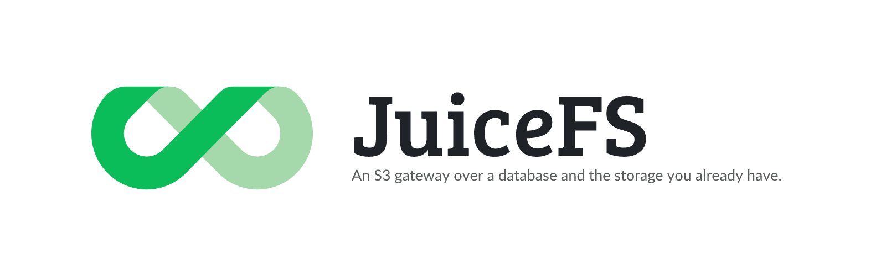
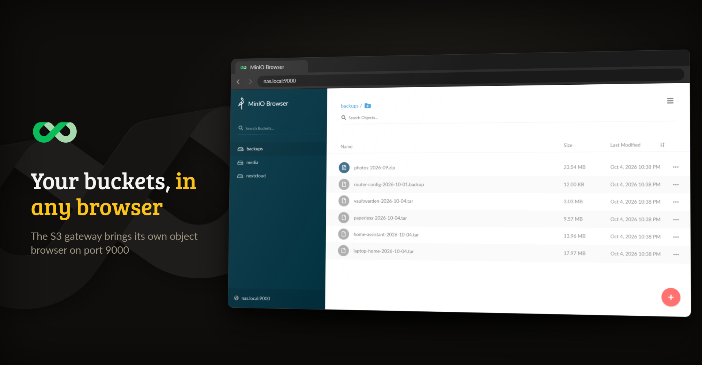
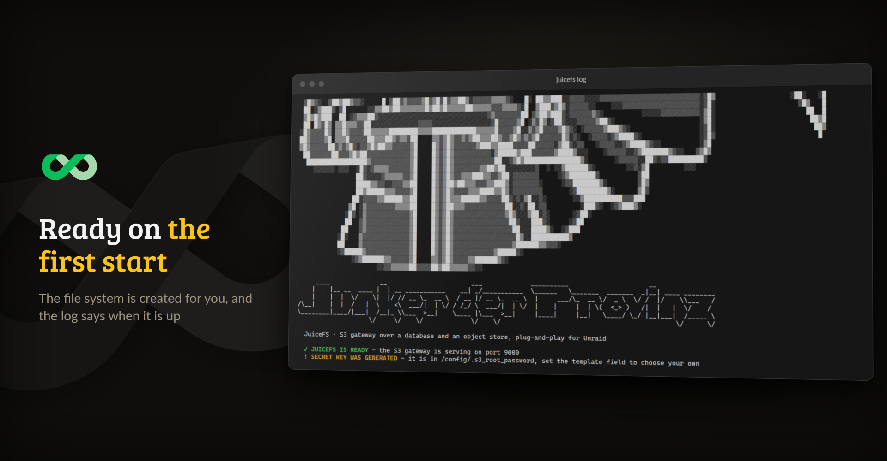

<picture>
  <source media="(prefers-color-scheme: dark)" srcset=".github/assets/banner-dark.png">
  
</picture>

<p align="center">
  <a href="https://github.com/junkerderprovinz/juicefs/actions/workflows/build.yml"></a>&nbsp;
  <a href="https://github.com/juicedata/juicefs"></a>&nbsp;
  <a href="https://ca.unraid.net/apps/juicefs-14sugi10m394v9"></a>&nbsp;
  <a href="LICENSE"></a>
</p>

<p align="center">
<b>JuiceFS</b> keeps file metadata in a database and file contents in an object
store. This container runs its <b>S3 gateway</b>, so everything on your server
that speaks S3 can talk to it. The official binary, unmodified, supervised by
s6-overlay. The file system is created on first boot, so there is no console
step between installing the template and using it.
</p>

<!-- download-buttons: written by scripts/gen_download_buttons.py -->
<p align="center">
  <a href="https://ca.unraid.net/apps/juicefs-14sugi10m394v9"></a>
  &nbsp;
  <a href="https://hub.docker.com/r/junkerderprovinz/juicefs/"></a>
  &nbsp;
  <a href="https://github.com/junkerderprovinz/juicefs/releases/latest"></a>
</p>
<!-- /download-buttons -->

<br>

<p align="center">
A one-knight job: I build it, keep it running, work through the issues and add what people ask for, until nothing is missing. It is free, with no accounts, no telemetry, no ads and no paid tier. No asterisk anywhere. Nothing readable ever leaves your own walls. Forged on evenings and weekends, with heart and stubbornness.
</p>

<p align="center">
If it has earned a place on your server or computer, toss a coin to your knight: it helps cover the costs and keeps the project alive. It also makes this knight's heart beat a little faster. Three ways below, whichever suits you.
</p>

<!-- give-buttons: written by scripts/gen_download_buttons.py -->
<p align="center">
  <a href="https://buymeacoffee.com/junkerderprovinz"></a>
  &nbsp;
  <a href="https://www.paypal.com/donate/?hosted_button_id=76FVV52TKXTUS"></a>
  &nbsp;
  <a href="https://junkerderprovinz.github.io/junkerderprovinz/"></a>
</p>
<!-- /give-buttons -->

<br>

## Table of Contents

1. [What it looks like](#1-what-it-looks-like)
2. [What it does](#2-what-it-does)
3. [Getting started](#3-getting-started)
4. [How AI is used here](#4-how-ai-is-used-here)
5. [Support this project](#5-support-this-project)

<br>

## 1. What it looks like

The buckets and files in these pictures are made up.

<p align="center">
  
  <br><em>The gateway's own object browser on port 9000, after signing in with the S3 keys</em>
</p>

<p align="center">
  
  <br><em>The end of the log after a first start, with the ready line and where the generated key is</em>
</p>

<br>

## 2. What it does

- **JuiceFS as an ordinary container.** Upstream offers a Docker volume plugin, which Unraid cannot install from a template, and the `juicedata/mount` image, which wants the whole command line written by hand. Here every setting is an environment variable, so every setting is a field in the template.
- **No console step.** The file system is created on the first start. Every later start finds it and leaves it alone, so a volume is never formatted twice.
- **S3 on port 9000, without FUSE.** The gateway needs neither `--privileged` nor shared mount propagation. Clients can create as many buckets as they like; set `MULTI_BUCKETS=false` for upstream's single bucket named after the volume.
- **Metadata where you want it.** SQLite under `/config` by default, so a fresh install needs nothing else. A Redis or Postgres URL in `META_URL` moves it to a database several machines can share.
- **Chunks, not files.** JuiceFS stores contents as chunks, so `/data` shows its own layout and not your file names. If you want an S3 API in front of a share you can still browse, VersityGW is the better fit.
- **The official binary.** It comes from the upstream release and is checked against the published SHA256 during the build.

<br>

## 3. Getting started

On Unraid, install JuiceFS from [Community Applications](https://ca.unraid.net/apps/juicefs-14sugi10m394v9) and start it. Nothing else is required. Anywhere else, one container is enough:

```sh
docker run -d --name juicefs -p 9000:9000 \
  -v /path/to/config:/config \
  -v /path/to/data:/data \
  junkerderprovinz/juicefs:latest
```

The log says `JUICEFS IS READY` once the gateway is up. The access key is `juicefs`. Without `S3_ROOT_PASSWORD` the container generates a secret key and writes it to `/config/.s3_root_password`; one you set yourself needs at least 8 characters. Then point any S3 client at it:

```bash
aws --endpoint-url http://<server>:9000 s3 mb s3://backups
aws --endpoint-url http://<server>:9000 s3 cp ./file.txt s3://backups/
```

`STORAGE`, `BUCKET` and `VOLUME_NAME` are read only when the file system is created, so choose them before the first start. They accept every backend JuiceFS supports, such as another S3 server or Backblaze B2 instead of the local disk.

Back up the metadata and the object store together, which with the defaults means `/config` and `/data`. The chunks are unreadable without the metadata, so a backup of `/data` alone is not a backup.

<br>

## 4. How AI is used here

One knight builds this, and AI is one of the tools I work with, the same way I work with an editor or a compiler. It helps me write code and documentation and it checks my work, and that saves me a good many evenings. It does not make the decisions, though. I read and understand everything before it ships, and if something here breaks, that is on me and not on the tool.

You do not have to take my word for it. The code is open and every release note is written by hand. The issue tracker shows how problems actually get handled, including the ones I got wrong the first time. If you find something that is not right, open an issue and I will look at it.

<br>

## 5. Support this project

Questions? Check the [support thread](https://forums.unraid.net/topic/198811-support-junkerderprovinz-unraid-apps/). Bugs, ideas or feature requests? Please [open a GitHub issue](https://github.com/junkerderprovinz/juicefs/issues).

A one-knight job: I build it, keep it running, work through the issues and add what people ask for, until nothing is missing. It is free, with no accounts, no telemetry, no ads and no paid tier. No asterisk anywhere. Nothing readable ever leaves your own walls. Forged on evenings and weekends, with heart and stubbornness.

If it has earned a place on your server or computer, toss a coin to your knight: it helps cover the costs and keeps the project alive. It also makes this knight's heart beat a little faster. Three ways below, whichever suits you.

<!-- give-buttons: written by scripts/gen_download_buttons.py -->
<p align="center">
  <a href="https://buymeacoffee.com/junkerderprovinz"></a>
  &nbsp;
  <a href="https://www.paypal.com/donate/?hosted_button_id=76FVV52TKXTUS"></a>
  &nbsp;
  <a href="https://junkerderprovinz.github.io/junkerderprovinz/"></a>
</p>
<!-- /give-buttons -->

<sub>JuiceFS is made by Juicedata and ships here unmodified under the Apache-2.0 licence.</sub>
